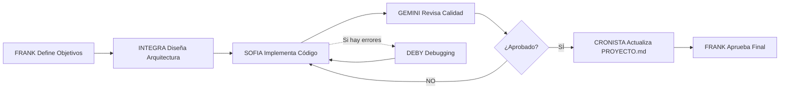

## 📘 ARQUITECTURA DISTRIBUIDA – SISTEMA INTEGRA EVOLUCIONADA v2.1

### I. Principios Operativos Generales
- **Metodología:** Integra Evolucionada.
- **Rol del Director (Frank):** Supervisor y validador del flujo completo. Interviene solo cuando hay tareas externas o con permisos especiales.
- **Principio de Flexibilidad Funcional:** Los roles de IA no son excluyentes; pueden apoyarse mutuamente o asumir tareas fuera de su dominio principal cuando la situación lo requiera.
- **Política de Justificación:** CODEX siempre explica brevemente el razonamiento detrás de cada decisión técnica o estructural.

---

### II. Ecosistema Google – Principio de Uso Inteligente y Abierto
- **Alcance:** El sistema Integra Evolucionada utiliza el ecosistema Google como eje operativo y de integración, sin limitarse a él. Incluye Workspace, Firebase, Cloud Platform, Vertex AI, Gemini, AppSheet, Apps Script y Sheets.
- **Filosofía de Uso:**
  > "Google es el punto de convergencia, no la jaula."

  Se prioriza el uso del entorno Google por su interoperabilidad, seguridad y bajo costo, pero las IA pueden emplear herramientas externas (IONOS, GitHub, Twilio, Zapier, etc.) cuando mejoren velocidad, compatibilidad o rendimiento.

- **Política de Elección de Herramientas (Principio del Cañón y la Mosca 🪰💣):**
  - Se elige la herramienta más ligera que resuelva el problema eficientemente.
  - Si algo puede hacerse en **Apps Script**, no se escala a **Cloud Run**.
  - Si basta con **Sheets o JSON local**, no se implementa una base de datos compleja.
  - Si se requiere integración avanzada, CODEX y/o GEMINI CODE ASSIST lo resuelven mediante conectores o middleware.

- **Interoperabilidad Técnica (Puentes):**
  CODEX genera y documenta conectores hacia:
  - Google Workspace API (Docs, Sheets, Drive)
  - Firebase / Firestore / Auth
  - Vertex AI / Gemini / PaLM
  - APIs externas (OpenAI, Twilio, IONOS, GitHub, Zapier, etc.)

  Estos puentes garantizan un flujo sin fricción entre ecosistemas y una capa de contexto unificada dentro de VS Code y Continue.

---

### III. Roles y Jerarquía de IA

La Metodología INTEGRA v2.0 utiliza un ecosistema de **5 agentes especializados** que trabajan en conjunto. Ver documentación completa en `meta/AGENTES.md`.

#### 👑 FRANK – Director de Proyecto (humano)
- Supervisa, valida y aprueba los entregables.
- No modifica estados en PROYECTO.md directamente; las IA gestionan el flujo.
- Su aprobación convierte una tarea en estado `[X] Aprobado`.

#### 🧠 INTEGRA – Arquitecto de Soluciones (Gemini 3 Pro)
- Gestiona el proyecto, estructura SPECs, valida entregables y genera PROYECTO.md.
- Define **qué** se construye, **en qué orden** y **con qué arquitectura**.
- Explica el porqué de cada decisión técnica o estratégica.
- Crea ADRs para decisiones arquitectónicas importantes.
- Supervisa la sincronización entre VS Code, Continue y GitHub.

#### ⚙️ SOFIA – Constructora Principal (Claude Haiku 4.5)
- Convierte tareas de `PROYECTO.md` y SPECs en **código funcional**.
- Implementa tests automatizados y documentación mínima necesaria.
- Actualiza estados de tareas: `[ ]` → `[~]` → `[/]` → `[V]` → `[✓]`.
- Crea checkpoints usando `meta/plantilla-checkpoint-enriquecido.md`.
- Tiene mayor acceso a herramientas del editor (lectura/escritura, ejecución).

#### 🔍 GEMINI – Infraestructura y Calidad (Gemini 3 Pro)
- **Infraestructura:** Google Cloud, Vercel, Render, Hostinger.
- **Auditoría de Calidad:** Revisa código contra Soft Gates y SPEC-CODIGO.md.
- Verifica seguridad, rendimiento y mantenibilidad.
- Valida decisiones arquitectónicas y propone mejoras.
- Puede rechazar código y devolverlo a SOFIA con feedback específico.

#### 🛡️ DEBY – Debugger Forense (Claude Opus 4.5)
- **Debugging Quirúrgico:** Rastrea causa raíz hasta el origen lógico/arquitectónico.
- **Trazabilidad Absoluta:** Genera ID único (`FIX-YYYYMMDD-NN`) para cada intervención.
- Crea dictámenes técnicos en `context/interconsultas/DICTAMEN_[ID].md`.
- Inyecta "marca de agua" en código con referencia al dictamen.
- No parcha síntomas, resuelve problemas de fondo.

#### 📝 CRONISTA – Administrador (GPT-5.1)
- Mantiene `PROYECTO.md` ordenado y actualizado.
- Actualiza estados de tareas y escribe notas explícitas.
- Detecta incoherencias (tareas `[✓]` sin notas, bloqueadas sin motivo).
- Referencia checkpoints y documentos relevantes.
- Solo escribe en `PROYECTO.md` (salvo reportes solicitados).

---

### IV. Flujo de Trabajo y Artefactos
- **Carpeta raíz:** `Proyectos/` → un folder por proyecto.
- **Subcarpetas estándar:**
  ```
  context/
  context/varios/
  propuestas/
  Checkpoints/
  meta/
  scripts/
  api/
  ```

- **Archivos base obligatorios:**
  - `PROYECTO.md` — Fuente central de tareas y estados.
  - `context/00_ARQUITECTURA_PROPUESTA.md` — Diseño técnico inicial.
  - `context/dossier_tecnico.md` — Bitácora técnica viva.
  - `context/SPEC-SEGURIDAD.md` — Especificación de medidas de seguridad.
  - `context/SPEC-TESTING.md` — Especificación de estrategia de testing.
  - `meta/SPEC-CODIGO.md` — Convenciones y estándares de código.
  - `meta/plantilla_control.md` — Estructura de checkpoints.
  - `meta/plantilla_SPEC.md` — Plantilla estandarizada para SPECs.
  - `meta/criterios_calidad.md` — Criterios de calidad del proyecto.
  - `.gitignore`, `.env`, `.env.example` — Manejo seguro de variables y secretos.

---

### V. Flujo de Roles



1. **INTEGRA** inicia y organiza tareas en PROYECTO.md, crea SPECs y define arquitectura.
2. **SOFIA** ejecuta construcción de código, tests y documentación según SPECs.
3. **GEMINI** revisa calidad, infraestructura y seguridad. Puede devolver a SOFIA si no cumple Soft Gates.
4. **DEBY** interviene cuando hay bugs complejos, genera dictámenes técnicos con trazabilidad total.
5. **CRONISTA** mantiene PROYECTO.md actualizado con estados y notas claras.
6. **FRANK** valida entregables finales y otorga aprobación `[X]`.

---

### VI. Políticas de Integración y Registro
- **Trazabilidad total:** Cada cambio genera un registro en `Checkpoints/`.
- **Control de versiones y respaldos automáticos:**
  - CODEX gestiona la sincronización con GitHub mediante commits automatizados.
  - Cada checkpoint aprobado por el asistente de implementación genera un commit con formato convencional (`feat`, `fix`, `docs`, etc.).
  - Al cierre de tarea `[✓]`, CODEX ejecuta un push automático al repositorio remoto.
  - Los repositorios se sincronizan también con Continue para mantener el contexto de versión actualizado.
- **Contexto compartido:** Todas las IA conservan sincronía de estado y contexto en Continue y VS Code.

---

### VI.5 Sistema de Gestión de Tareas y Calidad

Esta sección documenta el conjunto de mejoras implementadas para gestión de tareas, control de calidad y trazabilidad del proyecto.

#### 1. Sistema de Estados Granular
**Referencia:** `meta/sistema-estados.md`

- **8 estados operativos:**
  - `[ ]` Pendiente – Tarea creada, no iniciada
  - `[~]` Bloqueada – Esperando resolución de dependencia
  - `[/]` En progreso – Tarea activamente en desarrollo
  - `[V]` En validación – Completada, esperando revisión
  - `[R]` En revisión – GEMINI o Frank revisando
  - `[✓]` Completado – Aprobado y funcional
  - `[X]` Aprobado – Validación final de Frank
  - Especiales: `[!]` Urgente, `[?]` Requiere clarificación

- **Flujo completo:** `[ ] → [/] → [V] → [R] → [✓] → [X]`
- **Responsabilidades:**
  - CODEX (o GEMINI cuando implemente): Actualiza de `[ ]` a `[/]` y luego a `[V]`
  - GEMINI CODE ASSIST: Mueve de `[V]` a `[R]` y a `[✓]` tras validación
  - FRANK: Da aprobación final `[X]`

#### 2. Soft Gates (Puertas de Calidad)
**Referencia:** `meta/soft-gates.md`

- **4 gates obligatorios antes de `[✓]`:**
  1. **Compilación Gate:** TypeScript compila sin errores, ESLint pasa
  2. **Testing Gate:** Tests unitarios pasan, cobertura mínima alcanzada
  3. **Revisión Gate:** GEMINI audita código contra SPEC-CODIGO.md
  4. **Documentación Gate:** README actualizado, JSDoc en APIs públicas

- **Criterios de aprobación:** Cada gate requiere validación explícita
- **Excepciones permitidas:** Solo con justificación documentada en checkpoint

#### 3. Sistema de Priorización
**Referencia:** `meta/sistema-priorizacion.md`

- **Metadatos de tareas:**
  - **Prioridad:** P0 (crítica), P1 (alta), P2 (media), P3 (baja)
  - **Estimación:** T-shirt sizing (XS, S, M, L, XL)
  - **Dependencias:** IDs de tareas bloqueantes

- **Fórmulas de priorización:**
  ```
  Score = (Impacto × Urgencia) / Esfuerzo
  Impacto: 1-5 | Urgencia: 1-5 | Esfuerzo: 1-5
  ```

- **Gestión de bloqueadores:**
  - Tareas bloqueadas automáticamente marcadas `[~]`
  - Dashboard de dependencias actualizado en cada checkpoint

#### 4. Checkpoints Enriquecidos
**Referencia:** `meta/plantilla-checkpoint-enriquecido.md`

- **Estructura extendida:**
  - Metadatos: versión, autor, fecha, duración
  - Métricas: líneas modificadas, archivos afectados, tests añadidos
  - Decisiones técnicas: ADR embebidos o referenciados
  - Trazabilidad: commits, PRs, issues relacionados

- **Beneficios:** Historial completo de evolución del proyecto, auditoría técnica simplificada

#### 5. Sistema de Handoff
**Referencia:** `meta/sistema-handoff.md`

- **Protocolo de comunicación entre agentes:**
  - **Entrega de CODEX → asistente de implementacion:** SPEC completo, criterios de aceptación
  - **Entrega de asistente de implementacion → GEMINI CODE ASSIST:** Código completado, tests, documentación
  - **Entrega de GEMINI CODE ASSIST → FRANK:** Validación técnica, recomendaciones

- **Template de entrega:** Formato estandarizado en `meta/sistema-handoff.md`
- **Validación:** Checklist de completitud antes de pasar al siguiente agente

#### 6. ADR (Architecture Decision Records)
**Referencia:** `context/decisions/`

- **Documentación de decisiones arquitectónicas:**
  - Cada decisión técnica importante documentada en ADR
  - Formato: Contexto, Decisión, Consecuencias, Alternativas consideradas

- **Proceso:**
  1. CODEX identifica necesidad de ADR
  2. El asistente de implementación documenta decisión en `context/decisions/ADR-XXX-titulo.md`
  3. GEMINI CODE ASSIST revisa y valida razonamiento técnico
  4. Se referencia en checkpoints y PROYECTO.md

---

### VII. Estándares de Código y Calidad

- **Documento rector:** `meta/SPEC-CODIGO.md` define todas las convenciones y políticas de código.
- **Principios aplicables a todas las IA:**
  - **Código Auto-Documentado > Comentarios:** El código debe ser legible por sí mismo; los comentarios solo se usan para decisiones no obvias.
  - **Principio del Cañón y la Mosca aplicado al código:** Solución más simple que resuelva el problema.
  - **Tipado fuerte obligatorio:** TypeScript con tipos explícitos en APIs públicas.
  - **Sin comentarios innecesarios:** No parafrasear código, no dejar dead code comentado.
  
- **Responsabilidades por rol:**
  - **CODEX / GEMINI (cuando implementa):** Siguen SPEC-CODIGO.md al escribir código, evitan comentarios redundantes.
  - **GEMINI CODE ASSIST:** Audita cumplimiento de SPEC-CODIGO.md antes de aprobar código.
  - **CODEX:** Actualiza SPEC-CODIGO.md cuando surjan nuevas convenciones o decisiones arquitectónicas.

- **Checklist antes de `[✓]`:**
  - [ ] Código sigue convenciones de nombres (SPEC-CODIGO.md §II)
  - [ ] No hay comentarios innecesarios o desactualizados (SPEC-CODIGO.md §III)
  - [ ] Tipos TypeScript explícitos en APIs públicas (SPEC-CODIGO.md §V)
  - [ ] ESLint pasa sin errores
  - [ ] TypeScript compila sin errores

---

### VIII. Principio de Continuidad
- Si una IA falla, la siguiente asume sin pérdida de contexto.
- Todos los cambios quedan registrados y trazables.
- Solo FRANK puede cerrar oficialmente un proyecto (estado `[X] Aprobado`).
- En caso de fallo o rollback, CODEX puede restaurar automáticamente el último commit estable desde GitHub.

---

**Versión:** v2.1  
**Autor:** Frank Saavedra (Director de Proyecto)  
**IA Participantes:** INTEGRA, SOFIA, GEMINI, DEBY, CRONISTA

### Registro de Cambios

#### v2.1 (2025-12-26) - ACTUALIZACIÓN DE AGENTES
- ✨ **Sistema de 5 Agentes Especializados:**
  - INTEGRA (Gemini 3 Pro) - Arquitecto de Soluciones
  - SOFIA (Claude Haiku 4.5) - Constructora Principal
  - GEMINI (Gemini 3 Pro) - Infraestructura y Calidad
  - DEBY (Claude Opus 4.5) - Debugger Forense con Trazabilidad
  - CRONISTA (GPT-5.1) - Administrador de PROYECTO.md
- 📝 Nuevo documento: `meta/AGENTES.md` con documentación completa
- 🔄 Actualizado `arquitectura_distribuida_v_1.md` con nuevos roles y flujo
- 📚 Actualizado `README.md` con configuración de los 5 agentes
- 🛡️ Sistema de dictámenes técnicos de DEBY (`context/interconsultas/`)
- 📊 Diagramas mermaid de flujo de trabajo entre agentes
- 🎯 Matriz de responsabilidades por agente

#### v2.0 (2025-11-08) - MAJOR UPDATE
- ✨ Sistema de Estados Granular (8 estados)
- ✨ Soft Gates (4 puertas de calidad obligatorias)
- ✨ Sistema de Priorización y Metadatos
- ✨ Checkpoints Enriquecidos con métricas
- ✨ Sistema de Handoff entre agentes
- ✨ ADR (Architecture Decision Records)
- ✨ Versionado Semántico formalizado
- ✨ Template de Onboarding para nuevos agentes
- ✨ Script de Dashboard automático
- ✨ Configuración de Continue.dev
- 📝 10 nuevos documentos de metodología
- 🎯 42,000+ líneas de documentación profesional

#### v1.2 (2025-11-08)
- Agregada sección VII: Estándares de Código y Calidad
- Integración de `meta/SPEC-CODIGO.md` como documento rector de convenciones
- Actualizada lista de archivos base obligatorios (incluye SPECs de Seguridad, Testing y Código)
- GEMINI ahora aplica SPEC-CODIGO.md en cada revisión
- Checklist de calidad antes de marcar tareas como `[✓]`

#### v1.1 (original)
- Versión inicial de la Arquitectura Distribuida - Sistema Integra Evolucionada
